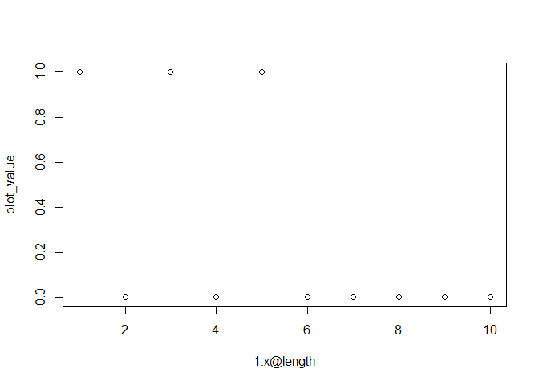

<!-- README.md is generated from README.Rmd. Please edit that file -->

# SpraseVectorsHW6

<!-- badges: start -->

[](https://github.com/MadelineRBoss/SparseVectorsHW6/actions/workflows/R-CMD-check.yaml)
<!-- badges: end -->

The goal of SpraseVectorsHW6 is to …

## Installation

You can install the development version of SpraseVectorsHW6 from
[GitHub](https://github.com/) with:

``` r
# install.packages("pak")
pak::pak("MadelineRBoss/SparseVectorsHW6")
```

## Example

Creating a Sparse Vector Object

``` r
library(SpraseVectorsHW6)
#> 
#> Attaching package: 'SpraseVectorsHW6'
#> The following object is masked from 'package:base':
#> 
#>     norm

x <- new("sparse_numeric",
                 value = c(1, 2, 3, 1),
                 pos = c(1L, 2L, 3L, 5L),
                 length = 10L)
y <- new("sparse_numeric",
                 value = c(4, 6, 1, 2),
                 pos = c(1L, 3L, 5L, 7L),
                 length = 10L)
```

Plot two vectors to see where they overlap

``` r
plot(x, y)
```



Add, Multiply, Subtract, and Cross Product Vectors

``` r
sparse_add(x,y)
#> The sparse vector of size 10 has the following values: 
#> position: 1 , value: 5 
#> position: 2 , value: 2 
#> position: 3 , value: 9 
#> position: 5 , value: 2 
#> position: 7 , value: 2
x + y
#> The sparse vector of size 10 has the following values: 
#> position: 1 , value: 5 
#> position: 2 , value: 2 
#> position: 3 , value: 9 
#> position: 5 , value: 2 
#> position: 7 , value: 2
```

``` r
sparse_mult(x,y)
#> The sparse vector of size 10 has the following values: 
#> position: 1 , value: 4 
#> position: 3 , value: 18 
#> position: 5 , value: 1
x * y
#> The sparse vector of size 10 has the following values: 
#> position: 1 , value: 4 
#> position: 3 , value: 18 
#> position: 5 , value: 1
```

``` r
print(sparse_sub(x,y))
#> The sparse vector of size 10 has the following values: 
#> position: 1 , value: -3 
#> position: 2 , value: 2 
#> position: 3 , value: -3 
#> position: 7 , value: -2
x - y
#> The sparse vector of size 10 has the following values: 
#> position: 1 , value: -3 
#> position: 2 , value: 2 
#> position: 3 , value: -3 
#> position: 7 , value: -2
```

``` r
print(sparse_crossprod(x,y))
#> [1] 23
```

Get the sum, mean, norm, and standardize vector

``` r
sparse_sum(x)
#> [1] 7
```

``` r
mean(x)
#> [1] 0.7
```

``` r
norm(x)
#> [1] 3.872983
```

``` r
standardize(x)
#> The sparse vector of size 10 has the following values: 
#> position: 1 , value: 0.2831925 
#> position: 2 , value: 1.227168 
#> position: 3 , value: 2.171143 
#> position: 4 , value: -0.6607826 
#> position: 5 , value: 0.2831925 
#> position: 6 , value: -0.6607826 
#> position: 7 , value: -0.6607826 
#> position: 8 , value: -0.6607826 
#> position: 9 , value: -0.6607826 
#> position: 10 , value: -0.6607826
```
